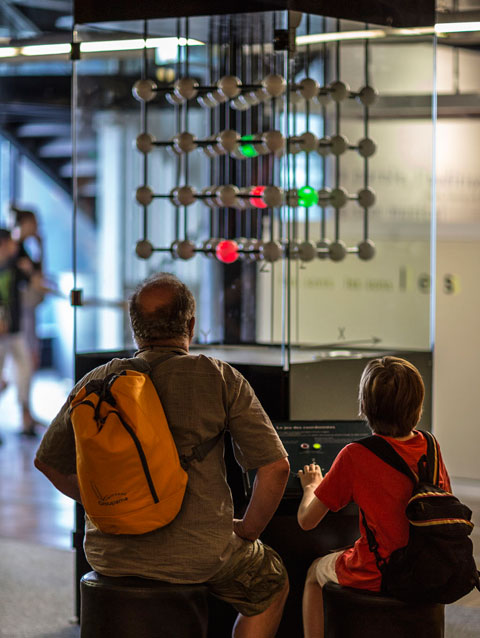
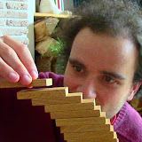
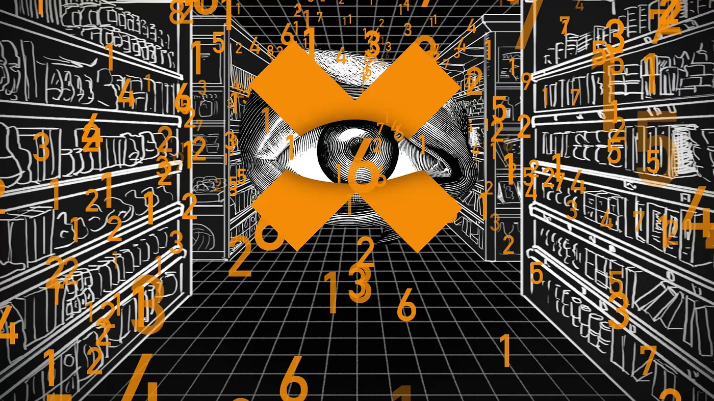

# Comment expliquer une notion scientifique complexe comme les fractales ?

Cette première question a été cruciale dans mes recherches car la notion de fractale n'est pas courante à expliquer ou à comprendre.
Pour trouver la meilleure façon de le faire, je me suis rapprochée de la médiation scientifique et de leur façon de travailler.

*Exposition sur les mathématiques* - CITÉ DES SCIENCES ET DE L'INDUSTRIE  
<br>
Crédit photo : Ph. Levy - EPPDCSI  
[Lien vers l'archive de l'exposition sur les mathématiques](https://www.cite-sciences.fr/fr/au-programme/expos-permanentes/les-expositions/mathematiques)

*C'est Pas Sorcier!* - Présenté par Jamy Gourmaud, Frédéric Courant, Sabine Quindou. Créé par le réalisateur Bernard Gonner.  


*MicMaths* - Mickaël Launay  


[Voyages au pays des maths - Sciences | ARTE](https://www.arte.tv/fr/videos/RC-021426/voyages-au-pays-des-maths/)



[Laboratoire NCET - YouTube](https://www.youtube.com/@LaboratoireNCET/videos)


Les possibilités d'apprentissage les plus courantes sont : l'animation, la modélisation et l'expérience.

J'en ai conclu par mes recherches dans ces différents aspects de la transmission du savoir que la meilleure façon d'expliquer une notion complexe est d'en faire une expérience.

## Mes idées :

### Montrer l'équation mathématique d'une fractale

1 équation explicite n'existe pas car :

- une équation donne un résultat

- une fractale décrit un comportement

- la forme vient de l'infini pas d'une formule fermée

mais on peut écrire un code python pour la fractale de Mandelbrot.
(Ce code ne fonctionne que sur la calculatrice Numworks)

```
from kandinsky import *
from math import *

# Largeur du graphe
W = 350
# Hauteur du graphe
H = 222
# Itération maximum
MAX_ITER = 40

for x in range(W):
    for y in range(H):
        a = (x - W/2) * 4 / W
        b = (y - H/2) * 4 / W
        ca, cb = a, b
        n = 0

        while n < MAX_ITER and a*a + b*b <= 4:
            a, b = a*a - b*b + ca, 2*a*b + cb
            n += 1

        color = (n*6 % 255, n*4 % 255, n*8 % 255)
        set_pixel(x, y, color)
```

J'ai fait tourner ce code sur une [calculatrice Numworks](https://www.numworks.com/fr/specs/) ce qui m'a permis de montrer que visualiser la fractale de Mandelbrot ne demande pas une énorme puissance de calcul.


### Expérimenter le flocon de Koch

Voir étape par étape le processus de création de cette fonction et comprendre sa construction.


### Expérimenter le zoom infini

Controlleur alternatif de la molette de la souris (ex : joystick) pour avancer ou reculer dans le zoom de la fractale. Peut-être avec l'équation qui s'affiche avec les données qui changent et les informations pertinentes.

Par exemple avec la fonction de Mandelbrot :

permettre au joueur de s'enfoncer dans la fractale grâce à un controlleur pertinent (pas forcément clavier souris).  
Exemple de zoom infini : <br>
[Hardest Mandelbrot zoom in 2014, 10^198 - 350 000 000 iterations - Youtube](https://www.youtube.com/watch?v=zXTpASSd9xE&t=1s) <br>
[XaoS - fast, fluid, continuous zooming](https://xaos-project.github.io/index.html)

Problèmes : puissance de calcul beaucoup trop importante...

### Expérimenter les fractales dans l'art

Par la peinture par exemple : [Découvre les fractales avec cette expérience ! - Youtube](https://www.youtube.com/watch?v=2hWwiU6_Wf8)
