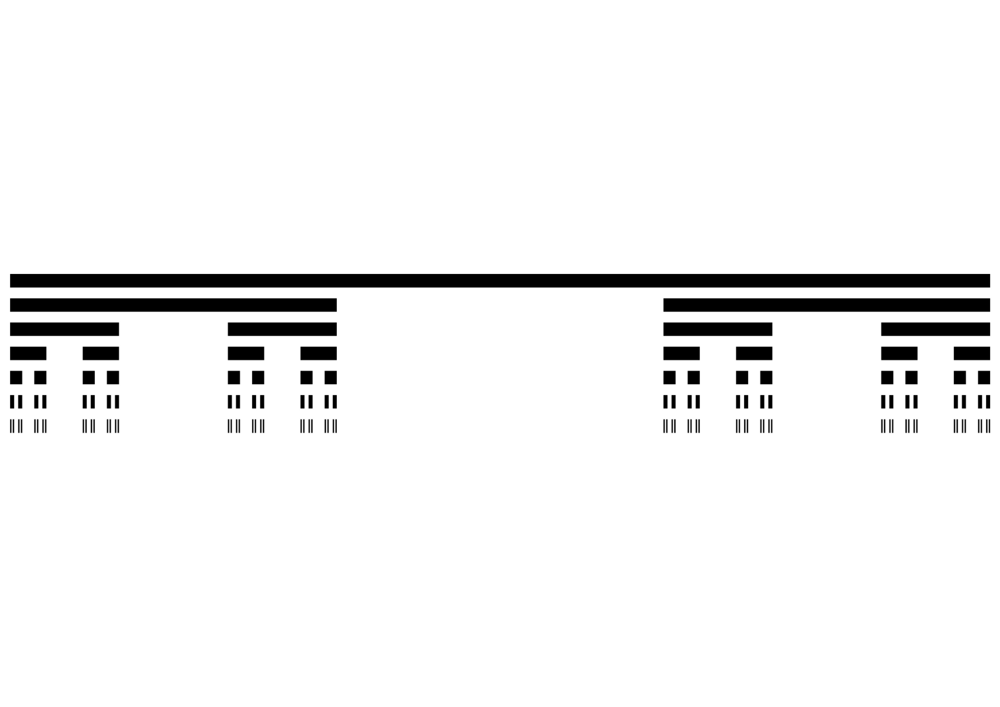
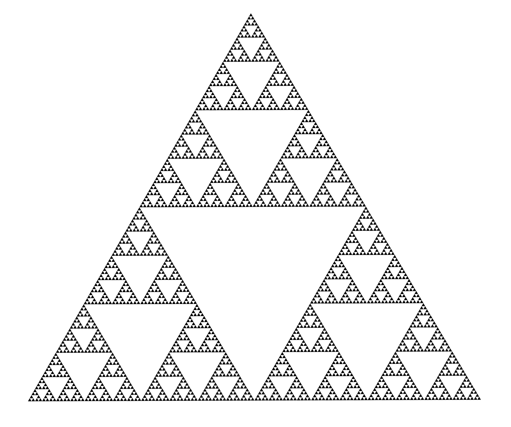
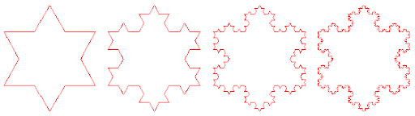
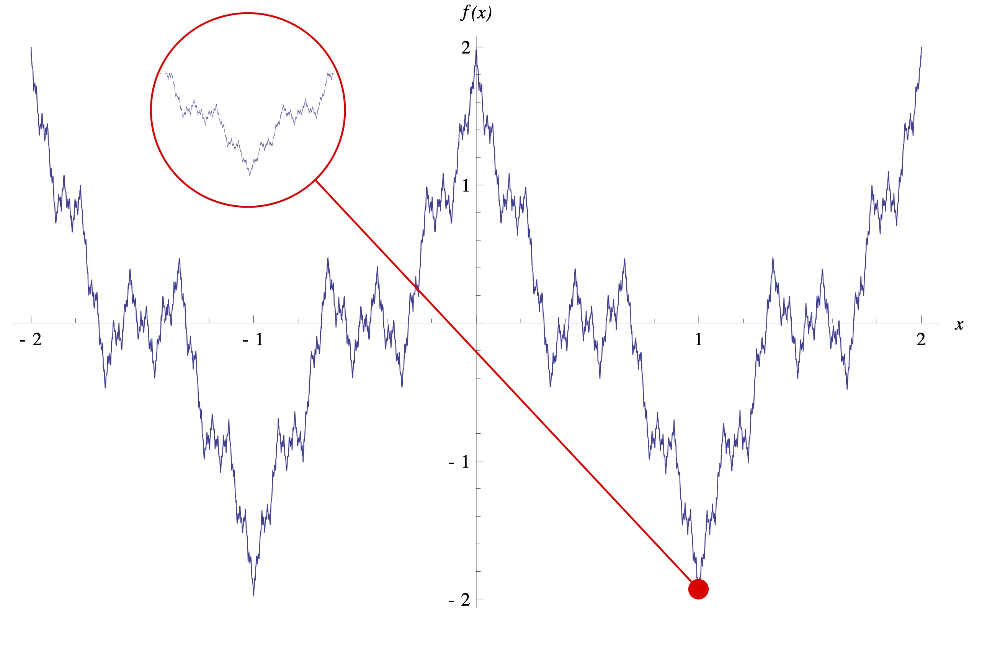

## Sommaire de la page

1. [Exemples dans les Sciences](#exemples-dans-les-sciences) 
2. [Exemples dans la Nature](#exemples-dans-la-nature) 
3. [Exemples en Art](#exemples-en-art) 

## Exemples dans les Sciences

### Ensemble de Mandelbrot

L'ensemble de Mandelbrot est une fractale du plan complexe définie par l'itération $z_{n+1} = z_n^2 + c$ avec $z_0 = 0$. Un point $c$ appartient à l'ensemble si la suite reste bornée (module < 2). Sa forme évoque une cardioïde avec des filaments infiniment détaillés au zoom.

→ complexe, itération, cardioïde, filaments, zoom-infini

### Ensemble de Julia

Pour un $c$ fixé, l'ensemble de Julia est l'image des points $z$ dont la suite $z_{n+1} = z_n^2 + c$ reste bornée. Mandelbrot indexe ces ensembles : connexes si $c$ dans Mandelbrot, discontinus sinon. Formes dendritiques ou cantoriennes selon $c$.

→ paramètre-fixe, dendritique, connecté, plan-complexe, variabilité-c

### Ensemble de Cantor

Construit en supprimant itérativement le tiers central d'un segment : reste 1/3, puis 1/9, etc. Longueur → 0 mais avec un nombre infini de points. Première fractale (1870), dimension fractale $\log 2 / \log 3 \approx 0.63$.

→ segment, tiers-supprimé, longueur-zéro, poussière-points, dimension : $0.63$

### Tapis de Sierpinski

Carré 3×3 où le centre est supprimé à chaque étape, puis récursivement dans les 8 subsquares. Aire → $0 (8/9^n)$, dimension $\log 8 / \log 3 \approx 1.89$. Remplit le plan sans trous mais sans surface.

→ carré, centre-supprimé, 8-souscarrés, aire-zéro, dimension : $1.89$

### Triangle de Sierpinski

Triangle équilatéral où on retire récursivement le triangle central à chaque itération. Surface → $0, 3^n$ segments de taille $1/2^n$. Dimension $\log 3 / \log 2 \approx 1.58$. Structure auto-similaire parfaite.

→ triangle, centre-retiré, trous-récursifs, surface-zéro, dimension : $1.58$

### Flocon de Koch

Courbe plane : tiers médian de chaque segment devient un "V" équilatéral. $Longueur → ∞ (4/3^n)$, périmètre infini enfermant aire finie. Dimension $\log 4 / \log 3 \approx 1.26$. Modèle de côte fractale.

→ segments, V-ajouté, périmètre-infini, côte-fractale, dimension : $1.26$

### Courbe de Peano / remplissage d'espace

  

Courbe continue sur passant par tous les points d'un carré. Récursive : divise carré en 9, relie centres par rotation. Dimension 2 (remplit aire), première space-filling curve (1890).
Découverte qui va mener à la courbe de Hilbert.

→ carré-rempli, 9-parties, rotation-centres, espace-filling, dimension : $2$

### Courbe de Hilbert

  

Variante préservant l'orientation : divise carré en 16, relie centres par U inversés. Récursive, longueur → ∞, dimension 2. Utilisée en indexation spatiale (Z-order curve).
Version aboutie de la courbe de Peano.

→ 16-parties, U-orientés, indexation-spatiale, longueur-infini, dimension : $2$

### Fonction de Weierstrass (surnommée de Weierstrass)

Fonction continue partout, dérivable nulle part. Somme infinie de cosinus :  
$f(x) = \sum_{n=0}^\infty a^n \cos(b^n \pi x)$ avec $0<a<1$, $ab>1+3\pi/2$.  
Première fractale fonctionnelle (1885), rugosité infinie à toutes les échelles.

→ continue, non-dérivable, rugosité infinie, dimension : $1.64$

## Exemples dans la Nature

[Fractales dans la nature - Sigma Documentaries](https://www.youtube.com/watch?v=rGwwydEWLiI)

## Exemples en Art

[Fractales à la recherche de la dimension cachée HD part 2/4 - inhosti](https://www.youtube.com/watch?v=yZ695z8VJVk&feature=youtu.be)  
→ 12'00" : les fractales dans Star Wars
